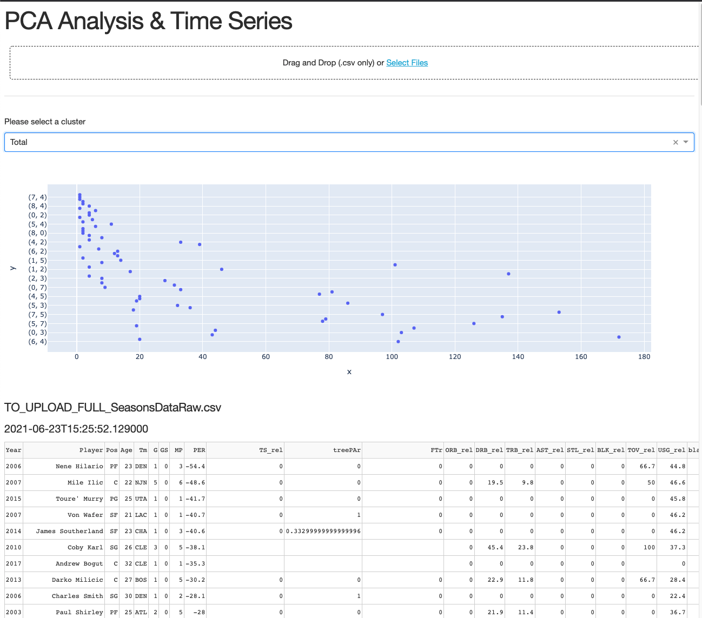

# Clustering on NBA League From 2003 to 2018

## Project Overview

Using unsupervised machine learning to analyze player decline in the NBA based on the player archetype.
This analysis will provide assistance to NBA teams for roster building and player adjustments.

The analysis will aim to provide insight on the following questions:

1. Determining the new player archytpe in the modern day position list.
2. Will adjusting the athletes playstyle help improve performance.

## Datasets

- [Kaggle Player Data](https://www.kaggle.com/drgilermo/nba-players-stats?select=player_data.csv)
  - A data [sample](ETL/Data/sample_data.xlsx) has been drafted.

## Environment

> cd db && python3 -m venv env

> source env/bin/activate

> pip install -r requirements.txt

> cd db && export PYTHONPATH=$PWD

### Additional packages

> pip freeze > requirements.txt

### FastAPI - Backend

> source env/bin/activate

> cd db && python app/main.py

> http://localhost:8000/docs

> Run /transformLoad

> Run /ml/pca

> Run /ml/timeseries

Make sure Mongo is running

### Frontend - Plotly Dash

> cd client && python app.py

#### MongoDB

> mongo

> show dbs

> use players

> db.Cleaned_Dataset.find()

### Team Project - UofT Bootcamp

## Communication Protocols

- **Slack**: Team discussions, questions, suggestisons & resource sharing.
- **Google Meet**: Team meetings, discussions
- **[Trello](https://trello.com/b/bpUG9Aoh/final-project-nba)**: Work organization, scheduling

Source: https://github.com/joshb738/NBA_Player_Analysis
